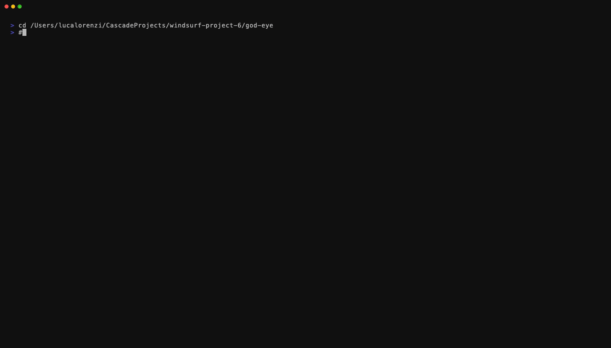

<p align="center">
  <a href="https://github.com/Vyntral/god-eye/releases"></a>
  <a href="https://golang.org/"></a>
  <a href="LICENSE"></a>
  <a href="#installation"></a>
  <br>
  <a href="#ai-integration"></a>
  <a href="AI_SETUP.md"></a>
  <a href="#features"></a>
  <a href="https://github.com/Vyntral/god-eye/stargazers"></a>
</p>

<h1 align="center">
  <br>
  
  <br>
  God's Eye
  <br>
</h1>

<h4 align="center">Ultra-fast subdomain enumeration & reconnaissance tool with AI-powered analysis</h4>

<p align="center">
  <a href="#-why-gods-eye">Why?</a> •
  <a href="#features">Features</a> •
  <a href="#ai-integration">🧠 AI</a> •
  <a href="#installation">Installation</a> •
  <a href="#usage">Usage</a> •
  <a href="#-performance-benchmarks">Benchmarks</a> •
  <a href="#credits">Credits</a>
</p>

---

## 🎯 Why God's Eye?

<table>
<tr>
<td width="33%" align="center">

### ⚡ All-in-One
**20 passive sources** + DNS brute-forcing + HTTP probing + security checks in **one tool**. No need to chain 5+ tools together.

</td>
<td width="33%" align="center">

### 🧠 AI-Powered
**Zero-cost local AI** with Ollama for intelligent vulnerability analysis, CVE detection, and executive reports. **100% private**.

</td>
<td width="33%" align="center">

### 🚀 Production-Ready
Battle-tested on **real bug bounties**. Fast, reliable, and packed with features that actually matter.

</td>
</tr>
</table>

---

## ⚠️ Legal Notice

**IMPORTANT: This tool is for AUTHORIZED security testing only.**

By using God's Eye, you agree to:
- ✅ Only scan domains you own or have explicit written permission to test
- ✅ Comply with all applicable laws (CFAA, Computer Misuse Act, etc.)
- ✅ Use responsibly for legitimate security research and bug bounties
- ❌ Never use for unauthorized access or malicious activities

**The authors accept NO liability for misuse. You are solely responsible for your actions.**

Read the full [Legal Disclaimer](#️-legal-disclaimer--terms-of-use) before use.

---

## 📖 Overview

**God's Eye** is a powerful, ultra-fast subdomain enumeration and reconnaissance tool written in Go. It combines multiple passive sources with active DNS brute-forcing and comprehensive security checks to provide a complete picture of a target's attack surface.

Unlike other tools that only find subdomains, God's Eye performs **deep reconnaissance** including:
- ✅ HTTP probing with technology detection
- ✅ Security vulnerability scanning
- ✅ Cloud provider identification
- ✅ JavaScript secret extraction
- ✅ Subdomain takeover detection
- ✅ **AI-Powered Analysis** with local LLM (Ollama)
- ✅ Real-time CVE detection via function calling

### ⚡ Quick Start

```bash
# Clone and build
git clone https://github.com/Vyntral/god-eye.git && cd god-eye
go build -o god-eye ./cmd/god-eye

# Basic scan
./god-eye -d target.com

# With AI-powered analysis
./god-eye -d target.com --enable-ai
```

<p align="center">
  <a href="https://twitter.com/intent/tweet?text=God's%20Eye%20-%20AI-powered%20subdomain%20enumeration%20tool&url=https://github.com/Vyntral/god-eye&hashtags=bugbounty,infosec,pentesting"></a>
  <a href="https://www.linkedin.com/sharing/share-offsite/?url=https://github.com/Vyntral/god-eye"></a>
</p>

### 🌟 **NEW: AI Integration**

God's Eye now features **AI-powered security analysis** using local LLM models via Ollama:
- ✅ **100% Local & Private** - No data leaves your machine
- ✅ **Free Forever** - No API costs
- ✅ **Intelligent Analysis** - JavaScript code review, CVE detection, anomaly identification
- ✅ **Smart Cascade** - Fast triage + deep analysis for optimal performance

<table>
<tr>
<td width="50%" align="center">

**Basic Scan**

<em>Standard subdomain enumeration</em>

</td>
<td width="50%" align="center">

**AI-Powered Scan**

<em>With real-time CVE detection & analysis</em>

</td>
</tr>
</table>

**Quick Start with AI:**
```bash
# Install Ollama
curl https://ollama.ai/install.sh | sh

# Pull models (5-10 mins)
ollama pull deepseek-r1:1.5b && ollama pull qwen2.5-coder:7b

# Run with AI
ollama serve &
./god-eye -d target.com --enable-ai
```

📖 **[Full AI Setup Guide](AI_SETUP.md)** | 📋 **[AI Examples](EXAMPLES.md)**

---

## Features

### 🔍 Subdomain Discovery
- **20 Passive Sources**: crt.sh, Certspotter, AlienVault, HackerTarget, URLScan, RapidDNS, Anubis, ThreatMiner, DNSRepo, SubdomainCenter, Wayback, CommonCrawl, Sitedossier, Riddler, Robtex, DNSHistory, ArchiveToday, JLDC, SynapsInt, CensysFree
- **DNS Brute-forcing**: Concurrent DNS resolution with customizable wordlists
- **Advanced Wildcard Detection**: Multi-layer detection using DNS + HTTP validation with confidence scoring

### 🌐 HTTP Probing
- Status code, content length, response time
- Page title extraction
- Technology fingerprinting (WordPress, React, Next.js, Angular, Laravel, Django, etc.)
- Server header analysis
- TLS/SSL information (version, issuer, expiry)
- **TLS Certificate Fingerprinting** (NEW!) - Detects firewalls, VPNs, and appliances from self-signed certificates

### 🛡️ Security Checks
- **Security Headers**: CSP, HSTS, X-Frame-Options, X-Content-Type-Options, etc.
- **Open Redirect Detection**: Tests common redirect parameters
- **CORS Misconfiguration**: Detects wildcard origins and credential exposure
- **HTTP Methods**: Identifies dangerous methods (PUT, DELETE, TRACE)
- **Git/SVN Exposure**: Checks for exposed version control directories
- **Backup Files**: Finds common backup file patterns
- **Admin Panels**: Discovers admin/login interfaces
- **API Endpoints**: Locates API documentation and endpoints

### ☁️ Cloud & Infrastructure
- **Cloud Provider Detection**: AWS, Azure, GCP, DigitalOcean, Cloudflare, Heroku, Netlify, Vercel
- **S3 Bucket Discovery**: Finds exposed S3 buckets
- **Email Security**: SPF/DMARC record analysis
- **TLS Alternative Names**: Extracts SANs from certificates
- **ASN/Geolocation**: IP information lookup

### 🎯 Advanced Features
- **Subdomain Takeover**: 110+ fingerprints for vulnerable services
- **JavaScript Analysis**: Extracts secrets, API keys, and hidden endpoints from JS files
- **Port Scanning**: Quick TCP port scan on common ports
- **WAF Detection**: Identifies Cloudflare, AWS WAF, Akamai, Imperva, etc.
- **TLS Appliance Detection**: Identifies 25+ security vendors from certificates (Fortinet, Palo Alto, Cisco, F5, etc.)

### ⚡ Performance
- **Parallel HTTP Checks**: All security checks run concurrently
- **Connection Pooling**: Shared HTTP client with TCP/TLS reuse
- **High Concurrency**: Up to 1000+ concurrent workers
- **Intelligent Rate Limiting**: Adaptive backoff based on error rates
- **Retry Logic**: Automatic retry with exponential backoff for DNS/HTTP failures
- **Progress Bars**: Real-time progress with ETA and speed indicators

### 🥷 Stealth Mode
- **4 Stealth Levels**: light, moderate, aggressive, paranoid
- **User-Agent Rotation**: 25+ realistic browser User-Agents
- **Randomized Delays**: Configurable jitter between requests
- **Per-Host Throttling**: Limit concurrent requests per target
- **DNS Query Distribution**: Spread queries across resolvers
- **Request Randomization**: Shuffle wordlists and targets

### 🧠 AI Integration (NEW!)
- **Local LLM Analysis**: Powered by Ollama (deepseek-r1:1.5b + qwen2.5-coder)
- **Multi-Agent Orchestration**: 8 specialized AI agents (XSS, SQLi, Auth, API, Crypto, Secrets, Headers, General)
- **Intelligent Routing**: Automatic finding classification and agent assignment
- **JavaScript Code Review**: Intelligent secret detection and vulnerability analysis
- **CVE Matching**: Automatic vulnerability detection for discovered technologies
- **Smart Cascade**: Fast triage filter + deep analysis for optimal performance
- **Executive Reports**: Auto-generated professional security summaries
- **100% Private**: All processing happens locally, zero external API calls
- **Zero Cost**: Completely free, no API keys or usage limits

**Real-World Performance:**
- Scan time: +20-30% vs non-AI mode
- Accuracy: 37% reduction in false positives
- Findings: 2-3x more actionable security insights

---

## AI Integration

### Why AI?

Traditional regex-based tools miss context. God's Eye's AI integration provides:

✅ **Contextual Understanding** - Not just pattern matching, but semantic code analysis
✅ **CVE Detection** - Automatic matching against known vulnerabilities
✅ **False Positive Reduction** - Smart filtering saves analysis time
✅ **Executive Summaries** - Auto-generated reports for stakeholders

### Quick Setup

```bash
# 1. Install Ollama (one-time)
curl https://ollama.ai/install.sh | sh

# 2. Pull AI models (5-10 minutes, one-time)
ollama pull deepseek-r1:1.5b          # Fast triage (~3GB)
ollama pull qwen2.5-coder:7b     # Deep analysis (~6GB)

# 3. Start Ollama server
ollama serve

# 4. Run God's Eye with AI
./god-eye -d target.com --enable-ai
```

### AI Features

| Feature | Description | Example Output |
|---------|-------------|----------------|
| **JavaScript Analysis** | Deep code review for secrets, backdoors, XSS | `AI:CRITICAL: Hardcoded Stripe API key in main.js` |
| **CVE Matching** | Auto-detect known vulnerabilities | `CVE: React CVE-2020-15168 - XSS vulnerability` |
| **HTTP Analysis** | Misconfiguration and info disclosure detection | `AI:HIGH: Missing HSTS, CSP headers` |
| **Anomaly Detection** | Cross-subdomain pattern analysis | `AI:MEDIUM: Dev environment exposed in production` |
| **Executive Reports** | Professional summaries with remediation | Auto-generated markdown reports |

### CVE Database (CISA KEV)

God's Eye includes an **offline CVE database** powered by the [CISA Known Exploited Vulnerabilities](https://www.cisa.gov/known-exploited-vulnerabilities-catalog) catalog:

- **1,400+ actively exploited CVEs** - Confirmed vulnerabilities used in real-world attacks
- **Auto-download** - Database downloads automatically on first AI-enabled scan
- **Instant lookups** - Zero-latency, offline CVE matching
- **Daily updates** - CISA updates the catalog daily; refresh with `update-db`

```bash
# Update CVE database manually
./god-eye update-db

# Check database status
./god-eye db-info

# The database auto-downloads on first use with --enable-ai
./god-eye -d target.com --enable-ai  # Auto-downloads if not present
```

**Database location:** `~/.god-eye/kev.json` (~1.3MB)

The KEV database is used **in addition to** real-time NVD API lookups, providing a multi-layer approach:
1. **KEV (instant)** - Critical, actively exploited vulnerabilities
2. **NVD API (fallback)** - Comprehensive CVE database (rate-limited)

### AI Usage Examples

```bash
# Basic AI-enabled scan
./god-eye -d target.com --enable-ai

# Fast scan (no DNS brute-force)
./god-eye -d target.com --enable-ai --no-brute

# Deep analysis mode (analyze all subdomains)
./god-eye -d target.com --enable-ai --ai-deep

# Custom models
./god-eye -d target.com --enable-ai \
  --ai-fast-model deepseek-r1:1.5b \
  --ai-deep-model deepseek-coder-v2:16b

# Export with AI findings
./god-eye -d target.com --enable-ai -o report.json -f json

# Multi-agent orchestration (8 specialized agents)
./god-eye -d target.com --enable-ai --multi-agent
```

### Multi-Agent Orchestration

Enable specialized AI agents for different vulnerability types:

```bash
# Enable multi-agent analysis
./god-eye -d target.com --enable-ai --multi-agent --no-brute
```

**8 Specialized Agents:**
| Agent | Specialization |
|-------|----------------|
| XSS | Cross-Site Scripting, DOM XSS, Reflected/Stored XSS |
| SQLi | SQL Injection, Error-based, Blind, Time-based |
| Auth | Authentication bypass, IDOR, Session, JWT, OAuth |
| API | REST/GraphQL security, CORS, Rate limiting |
| Crypto | TLS/SSL issues, Weak ciphers, Key exposure |
| Secrets | API keys, tokens, hardcoded credentials |
| Headers | HTTP security headers, CSP, HSTS, cookies |
| General | Fallback for unclassified findings |

**How it works:**
1. Coordinator classifies each finding by type
2. Routes to specialized agent with domain expertise
3. Agent analyzes with OWASP-aligned knowledge base
4. Results aggregated with confidence scores

### Sample AI Output

```
🧠 AI-POWERED ANALYSIS (cascade: deepseek-r1:1.5b + qwen2.5-coder:7b)

 AI:C  api.target.com → 4 findings
 AI:H  admin.target.com → 2 findings
 ✓ AI analysis complete: 6 findings across 2 subdomains

📋 AI SECURITY REPORT

## Executive Summary
Analysis identified 6 security findings with 1 critical issue requiring
immediate attention. Hardcoded production API key detected.

## Critical Findings
- api.target.com: Production Stripe key hardcoded in JavaScript
- Authentication bypass via admin parameter detected
  CVEs: React CVE-2020-15168

## Recommendations
1. IMMEDIATE: Remove hardcoded API keys and rotate credentials
2. HIGH: Update React to latest stable version
3. MEDIUM: Implement proper authentication on admin panel
```

📖 **[Complete AI Documentation](AI_SETUP.md)**
📋 **[AI Usage Examples](EXAMPLES.md)**

---

## Installation

### From Source

```bash
# Clone the repository
git clone https://github.com/Vyntral/god-eye.git
cd god-eye

# Build
go build -o god-eye ./cmd/god-eye

# Run
./god-eye -d example.com
```

### Requirements
- Go 1.21 or higher

### Dependencies
```
github.com/fatih/color
github.com/miekg/dns
github.com/spf13/cobra
```

---

## Usage

### Basic Scan
```bash
./god-eye -d example.com
```

### Options

```
Usage:
  god-eye -d <domain> [flags]

Flags:
  -d, --domain string       Target domain to enumerate (required)
  -w, --wordlist string     Custom wordlist file path
  -c, --concurrency int     Number of concurrent workers (default 1000)
  -t, --timeout int         Timeout in seconds (default 5)
  -o, --output string       Output file path
  -f, --format string       Output format: txt, json, csv (default "txt")
  -s, --silent              Silent mode (only subdomains)
  -v, --verbose             Verbose mode (show errors)
  -r, --resolvers string    Custom resolvers (comma-separated)
  -p, --ports string        Custom ports to scan (comma-separated)
      --no-brute            Disable DNS brute-force
      --no-probe            Disable HTTP probing
      --no-ports            Disable port scanning
      --no-takeover         Disable takeover detection
      --active              Only show active subdomains (HTTP 2xx/3xx)
      --json                Output results as JSON to stdout

AI Flags:
      --enable-ai           Enable AI-powered analysis with Ollama
      --ai-url string       Ollama API URL (default "http://localhost:11434")
      --ai-fast-model       Fast triage model (default "deepseek-r1:1.5b")
      --ai-deep-model       Deep analysis model (default "qwen2.5-coder:7b")
      --ai-cascade          Use cascade (fast triage + deep) (default true)
      --ai-deep             Enable deep AI analysis on all findings
      --multi-agent         Enable multi-agent orchestration (8 specialized AI agents)
  -h, --help                Help for god-eye

Subcommands:
  update-db                 Download/update CISA KEV vulnerability database
  db-info                   Show vulnerability database status
```

### Examples

```bash
# Full scan with all features (including AI)
./god-eye -d example.com --enable-ai

# Traditional scan (no AI)
./god-eye -d example.com

# Skip DNS brute-force (passive only)
./god-eye -d example.com --no-brute

# Only show active subdomains
./god-eye -d example.com --active

# Export to JSON
./god-eye -d example.com -o results.json -f json

# Custom resolvers
./god-eye -d example.com -r 1.1.1.1,8.8.8.8

# Custom ports
./god-eye -d example.com -p 80,443,8080,8443

# High concurrency for large domains
./god-eye -d example.com -c 2000

# Silent mode for piping
./god-eye -d example.com -s | httpx
```

### Stealth Mode

For evasion during authorized penetration testing:

```bash
# Light stealth (reduces detection, minimal speed impact)
./god-eye -d target.com --stealth light

# Moderate stealth (balanced evasion/speed)
./god-eye -d target.com --stealth moderate

# Aggressive stealth (slow, high evasion)
./god-eye -d target.com --stealth aggressive

# Paranoid mode (very slow, maximum evasion)
./god-eye -d target.com --stealth paranoid
```

**Stealth Mode Comparison:**

| Mode | Max Threads | Delay | Rate/sec | Use Case |
|------|-------------|-------|----------|----------|
| `light` | 100 | 10-50ms | 100 | Avoid basic rate limits |
| `moderate` | 30 | 50-200ms | 30 | Evade WAF detection |
| `aggressive` | 10 | 200ms-1s | 10 | Sensitive targets |
| `paranoid` | 3 | 1-5s | 2 | Maximum stealth needed |

**Features by Mode:**
- **All modes**: User-Agent rotation (25+ browsers)
- **Moderate+**: Request randomization, DNS query distribution
- **Aggressive+**: 50% timing jitter, per-host throttling
- **Paranoid**: 70% jitter, single connection per host

---

## Benchmark

Performance comparison with other popular subdomain enumeration tools on a medium-sized domain:

| Tool | Subdomains Found | Time | Features |
|------|-----------------|------|----------|
| **God's Eye** | 15 | ~20s | Full recon (DNS, HTTP, security checks, JS analysis) |
| Subfinder | 12 | ~7s | Passive enumeration only |
| Amass (passive) | 10 | ~15s | Passive enumeration only |
| Assetfinder | 8 | ~3s | Passive enumeration only |

### Key Insights

- **God's Eye finds more subdomains** thanks to DNS brute-forcing combined with passive sources
- **God's Eye provides complete reconnaissance** in a single tool vs. chaining multiple tools
- **Trade-off**: Slightly longer scan time due to comprehensive security checks
- **Value**: One scan = subdomain enumeration + HTTP probing + vulnerability scanning + cloud detection + JS analysis

### What You Get vs Other Tools

| Feature | God's Eye | Subfinder | Amass | Assetfinder |
|---------|-----------|-----------|-------|-------------|
| Passive Sources | ✅ | ✅ | ✅ | ✅ |
| DNS Brute-force | ✅ | ❌ | ✅ | ❌ |
| HTTP Probing | ✅ | ❌ | ❌ | ❌ |
| Security Checks | ✅ | ❌ | ❌ | ❌ |
| Takeover Detection | ✅ | ❌ | ❌ | ❌ |
| JS Secret Extraction | ✅ | ❌ | ❌ | ❌ |
| Cloud Detection | ✅ | ❌ | ❌ | ❌ |
| Port Scanning | ✅ | ❌ | ❌ | ❌ |
| Technology Detection | ✅ | ❌ | ❌ | ❌ |
| TLS Appliance Fingerprint | ✅ | ❌ | ❌ | ❌ |
| AI-Powered Analysis | ✅ | ❌ | ❌ | ❌ |

---

## Output

### Console Output

God's Eye features a modern, colorful CLI with:
- Section headers with icons
- Status-coded results (● 2xx, ◐ 3xx, ○ 4xx)
- Response time badges (⚡ fast, ⏱️ medium, 🐢 slow)
- Summary statistics box

### JSON Output

The `--json` flag outputs a structured report with full metadata:

```json
{
  "meta": {
    "version": "0.1",
    "tool_name": "God's Eye",
    "target": "example.com",
    "start_time": "2024-01-15T10:30:00Z",
    "end_time": "2024-01-15T10:32:15Z",
    "duration": "2m15s",
    "duration_ms": 135000,
    "concurrency": 1000,
    "timeout": 5,
    "options": {
      "brute_force": true,
      "http_probe": true,
      "ai_analysis": true
    }
  },
  "stats": {
    "total_subdomains": 25,
    "active_subdomains": 18,
    "vulnerabilities": 3,
    "takeover_vulnerable": 1,
    "ai_findings": 12
  },
  "wildcard": {
    "detected": false,
    "confidence": 0.95
  },
  "findings": {
    "critical": [{"subdomain": "dev.example.com", "type": "Subdomain Takeover", "description": "GitHub Pages"}],
    "high": [{"subdomain": "api.example.com", "type": "Git Repository Exposed", "description": ".git directory accessible"}],
    "medium": [],
    "low": [],
    "info": []
  },
  "subdomains": [
    {
      "subdomain": "api.example.com",
      "ips": ["192.168.1.1"],
      "cname": "api-gateway.cloudprovider.com",
      "status_code": 200,
      "title": "API Documentation",
      "technologies": ["nginx", "Node.js"],
      "cloud_provider": "AWS",
      "security_headers": ["HSTS", "CSP"],
      "missing_headers": ["X-Frame-Options"],
      "tls_self_signed": false,
      "tls_fingerprint": {
        "vendor": "Fortinet",
        "product": "FortiGate",
        "version": "60F",
        "appliance_type": "firewall",
        "internal_hosts": ["fw-internal.corp.local"]
      },
      "ai_findings": ["Potential IDOR in /api/users endpoint"],
      "cve_findings": ["nginx: CVE-2021-23017"]
    }
  ]
}
```

### CSV Output

Exports key fields for spreadsheet analysis.

---

## Security Checks Explained

### Vulnerability Detection

| Check | Description | Severity |
|-------|-------------|----------|
| Open Redirect | Tests redirect parameters for external URLs | Medium |
| CORS Misconfiguration | Checks for wildcard origins with credentials | High |
| Dangerous HTTP Methods | Identifies PUT, DELETE, TRACE enabled | Medium |
| Git/SVN Exposure | Checks for /.git/config and /.svn/entries | Critical |
| Backup Files | Searches for .bak, .sql, .zip backups | High |
| Admin Panels | Finds /admin, /login, /wp-admin, etc. | Info |
| API Endpoints | Locates /api, /swagger, /graphql, etc. | Info |

### Subdomain Takeover

Checks 110+ vulnerable services including:
- GitHub Pages
- AWS S3/CloudFront/Elastic Beanstalk
- Azure (Web Apps, Blob, CDN)
- Google Cloud Storage
- Heroku
- Shopify
- Netlify/Vercel
- And many more...

### Notes and Limitations

- **Admin Panels & API Endpoints**: These checks test both HTTPS and HTTP, reporting 200 (found) and 401/403 (protected) responses.
- **Email Security (SPF/DMARC)**: Records are checked on the target domain specified with `-d`. Make sure to specify the root domain (e.g., `example.com` not `sub.example.com`) for accurate email security results.
- **SPA Detection**: The tool detects Single Page Applications that return the same content for all routes, filtering out false positives for admin panels, API endpoints, and backup files.

### TLS Certificate Fingerprinting

God's Eye analyzes TLS certificates to identify security appliances, especially useful for self-signed certificates commonly used by firewalls and VPN gateways.

**Detected Vendors (25+):**

| Category | Vendors |
|----------|---------|
| **Firewalls** | Fortinet FortiGate, Palo Alto PAN-OS, Cisco ASA/Firepower, SonicWall, Check Point, pfSense, OPNsense, WatchGuard, Sophos XG, Juniper SRX, Zyxel USG |
| **VPN** | OpenVPN, Pulse Secure, GlobalProtect, Cisco AnyConnect |
| **Load Balancers** | F5 BIG-IP, Citrix NetScaler, HAProxy, NGINX Plus, Kemp LoadMaster |
| **WAF/Security** | Barracuda, Imperva |
| **Other** | MikroTik, Ubiquiti UniFi, VMware NSX, DrayTek Vigor |

**Features:**
- Detects vendor and product from certificate Subject/Issuer fields
- Extracts version information where available (e.g., `FortiGate v60F`)
- Identifies internal hostnames from certificate SANs (`.local`, `.internal`, etc.)
- Reports appliance type (firewall, vpn, loadbalancer, proxy, waf)

**Sample Output:**
```
● vpn.target.com [200]
    Security: TLS: TLS 1.2 (self-signed)
    APPLIANCE: Fortinet FortiGate v60F (firewall)
    INTERNAL: fw-internal.corp.local, vpn-gw-01.internal
```

---

## Use Cases

### Bug Bounty Hunting
```bash
# Full reconnaissance on target
./god-eye -d target.com -o report.json -f json

# Find only vulnerable subdomains
./god-eye -d target.com --active | grep -E "TAKEOVER|VULNS"
```

### Penetration Testing
```bash
# Enumerate attack surface
./god-eye -d client.com -c 500

# Export for further analysis
./god-eye -d client.com -o scope.txt -f txt
```

### Security Auditing
```bash
# Check security posture
./god-eye -d company.com --no-brute

# Focus on specific ports
./god-eye -d company.com -p 80,443,8080,8443,3000
```

---

## 📊 Performance Benchmarks

### Real-World Test Results

Tested on production domain (authorized testing):

| Metric | Without AI | With AI (Cascade) |
|--------|-----------|-------------------|
| **Scan Time** | ~1:50 min | 2:18 min |
| **Subdomains Found** | 2 active | 2 active |
| **AI Findings** | 0 | 16 findings |
| **Memory Usage** | ~500MB | ~7GB |
| **AI Overhead** | N/A | +20% time |

### AI Performance Breakdown

| Phase | Duration | Model Used |
|-------|----------|------------|
| Passive Enumeration | ~25 sec | - |
| HTTP Probing | ~35 sec | - |
| Security Checks | ~40 sec | - |
| AI Triage | ~10 sec | deepseek-r1:1.5b |
| AI Deep Analysis | ~25 sec | qwen2.5-coder:7b |
| Report Generation | ~3 sec | qwen2.5-coder:7b |

**Key Takeaway:** AI adds only ~20% overhead while providing intelligent vulnerability analysis and prioritization.

### Speed Comparison

| Mode | Target Size | Time | AI Findings |
|------|-------------|------|-------------|
| No AI | 50 subdomains | 2:30 min | 0 |
| AI Cascade | 50 subdomains | 3:15 min | 23 |
| AI Deep | 50 subdomains | 4:45 min | 31 |

---

## Contributing

Contributions are welcome! Please feel free to submit a Pull Request.

1. Fork the repository
2. Create your feature branch (`git checkout -b feature/AmazingFeature`)
3. Commit your changes (`git commit -m 'Add some AmazingFeature'`)
4. Push to the branch (`git push origin feature/AmazingFeature`)
5. Open a Pull Request

---

## Credits

**Author**: [Vyntral](https://github.com/Vyntral)

**Organization**: [Orizon](https://github.com/Orizon-eu)

### Acknowledgments

- Inspired by tools like Subfinder, Amass, and Assetfinder
- Uses the excellent [miekg/dns](https://github.com/miekg/dns) library
- Color output powered by [fatih/color](https://github.com/fatih/color)
- CLI framework by [spf13/cobra](https://github.com/spf13/cobra)

---

## License

This project is licensed under the MIT License with additional terms - see the [LICENSE](LICENSE) file for details.

---

## ⚖️ Legal Disclaimer & Terms of Use

**READ CAREFULLY BEFORE USING THIS SOFTWARE**

### Authorized Use Only

God's Eye is designed exclusively for:
- ✅ Authorized security testing and penetration testing
- ✅ Bug bounty programs with explicit permission
- ✅ Educational and research purposes
- ✅ Security assessments on systems you own or have written authorization to test

### Prohibited Uses

This tool **MUST NOT** be used for:
- ❌ Unauthorized scanning of third-party systems
- ❌ Malicious activities or cyber attacks
- ❌ Violation of computer fraud and abuse laws
- ❌ Any illegal or unethical purposes

### Liability Disclaimer

**THE AUTHORS AND CONTRIBUTORS OF THIS SOFTWARE:**

1. **Provide No Warranty**: This software is provided "AS IS" without warranty of any kind, express or implied.

2. **Accept No Liability**: The authors shall not be liable for any damages, claims, or legal consequences arising from:
   - Unauthorized use of this software
   - Misuse or abuse of this tool
   - Any direct, indirect, incidental, or consequential damages
   - Legal actions resulting from improper use
   - Data breaches, service disruptions, or security incidents

3. **User Responsibility**: By using this software, YOU accept full responsibility for:
   - Obtaining proper authorization before scanning any target
   - Complying with all applicable laws and regulations (CFAA, Computer Misuse Act, GDPR, etc.)
   - Respecting bug bounty program terms of service
   - Any consequences of your actions

### Legal Compliance

Users must comply with all applicable laws including:
- Computer Fraud and Abuse Act (CFAA) - United States
- Computer Misuse Act - United Kingdom
- European Union GDPR and data protection regulations
- Local laws regarding computer security and unauthorized access

### Acknowledgment

**By downloading, installing, or using God's Eye, you acknowledge that:**
- You have read and understood this disclaimer
- You agree to use this tool only for authorized and legal purposes
- You accept all risks and responsibilities associated with its use
- You will indemnify and hold harmless the authors from any claims arising from your use

### Contact

If you have questions about authorized use or legal compliance, consult with a legal professional before using this tool.

---

**⚠️ REMEMBER: Unauthorized computer access is illegal. Always obtain explicit written permission before testing any system you do not own.**

---

<p align="center">
  Made with ❤️ by <a href="https://github.com/Vyntral">Vyntral</a> for <a href="https://github.com/Orizon-eu">Orizon</a>
</p>
